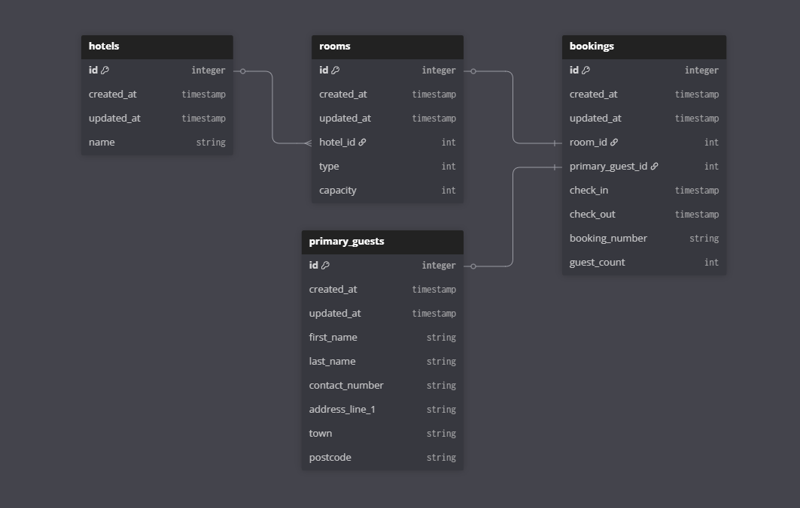

# 🏨 Hotel Booking System
### A challenge from Waracle.
API for finding available hotels, rooms and creating/referencing bookings.

### [Click here for Project Kanban Board](https://github.com/users/lew148/projects/1)

## How to run
* Open VS or Rider
* Restore nuget packages
* if (```hotelbooking.db``` doest exist)
  * ```dotnet ef database update``` - to create SQLite database
* Run in IDE for Swagger UI

## Tech Overview
> ASP.Net 8.0 API with Swagger UI

* Entity Framework 8.0 for Database mapping
* SQLite Database 8.0 for portability and ease of use
  * <font size="+1">⚠️</font> **```hotelbooking.db``` and connection string, in appsettings.json, have been left in source. These will need removing for live data**
  * should migrate to SQL Server when scaling, alongside Azure hosting

### Database Schema
