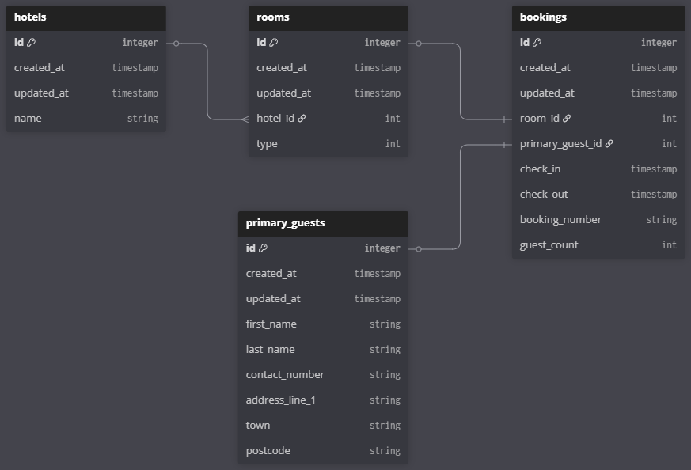

# 🏨 Hotel Booking System
### A challenge from Waracle.
API for finding available hotels, rooms and creating/referencing bookings.

# Tech Overview
> ASP.Net 8.0 API with Swagger UI

* Entity Framework 8.0 for Database mapping
* SQLite Database 8.0 for portability and ease of use
  * ⚠️ **connection string has been left in appsettings.json and MUST be pulled into an environment variable for live database!**
  * should migrate to SQL Server when scaling, alongside Azure hosting

### Database Schema

## How to run
* Open .sln in VS studio or Rider
* Restore nuget packages
* Run in IDE for Swagger UI
